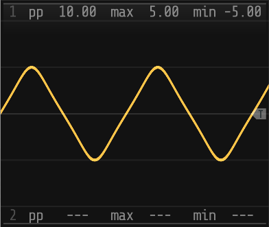
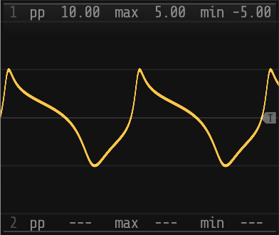

# sn

A set of [VCV Rack 2](https://vcvrack.com/Rack) plugins for the _sn_ experimental additive synthesizer which
uses the _sn_ function as the generator function instead of the more usual _sine_. The modules comprise:
- a _stackable_ VCO, which generates an audio signal with a smoothly adjustable waveshape
- a _stackable_ LFO, which generates a low frequency control voltage signal with a smoothly adjustable waveshape.

      

The modules don't do anything particuarly radical but are an interesting way to add subtle variations to a sound. 
e.g. the [Greensleeves](#greensleeves) demo is an example of using the _sn-vco_ to add some tonal interest to an
otherwise fairly plain rendering.

### Contents

- [Background](#background)
- [Modules](#modules)
- [Manual](/documentation/MANUAL.md)
   - [sn-vco](/documentation/MANUAL.md#sn-vco)
   - [sn-vcox](/documentation/MANUAL.md#sn-vcox)
   - [sn-lfo](/documentation/MANUAL.md#sn-lfo)
   - [sn-lfox](/documentation/MANUAL.md#sn-lfox)
- [Demos](#demo-patches)
   - [Basic operation](#basic-operation)
   - [Greensleeves](#greensleeves)
   - [Toccata in Dm](#toccata-in-dm) 
- [Acknowledgements](#acknowledgements)
- [License](#license)


### Background

Mathematically a _sine_ function is a special case of the Jacobi elliptic _sn_ function (in the same way that
a circle is a special case of an ellipse). The _sn_ VCV modules use the _sn_ function rather than the
_sine_ function to generate harmonically rich waveforms that are also continuous and differentiable.

By modifying the parameters of the _sn_ function it is possible to smoothly morph between a sine wave,
a square (well, square'ish) wave, a triangular'ish wave and a sawtooth. There is a [web app](https://snyth.pages.dev)
which may make this a bit clearer than this umm, very extremely brief explanation, and there is a little
more detail [here](https://github.com/transcriptaze/snyth) if you're really curious.


### Parameters

The modules share a common set of parameters that determine the wave shape:

| Parameter | Range | Name           | Description                                                     |
|-----------|-------|----------------|-----------------------------------------------------------------|
| _ε_       | ±1    | _eccentricity_ | Sets the _eccentricity_ of the _sn_ generator function          |
| _s_       | 0-5   | _sensitivity_  | Fine adjust for the _eccentricity_ set by the _ε_ control       |
| _θ_       | ±90°  | _rotation_     | Sets the rotation angle of he _sn_ generator function           |
| _a_       | 0-1   | _amplitude_    | Sets the amplitude of the harmonic component                    |
| _δx_      | ±1    | _shift-x_      | Sets the horizontal shift of the _sn_ generator function        |
| _δy_      | ±1    | _shift-y_      | Sets the vertical shift of the _sn_ generator function          |
| _Φ_       | ±90°  | _phase_        | Adjust the phase offset of a harmonic (LFO only)                |
| _m_       | 1-5   | _multiplier_   | Base frequency multiplier                                       |

## Installation

### VCV Rack Library

_(hopefully one of these days)_

### Manual

1. Download the _zip_ file for your platform from the [Releases](https://github.com/transcriptaze/sn-vcv/releases)
   section.

2. Unzip the downloaded file and copy the unzipped plugin to the _VCV Rack 2_ plugins directory:
   - MacOS + Intel: `~/Documents/Rack2/plugins-mac-x64/`
   - MacOS + ARM: `~/Documents/Rack2/plugins-mac-arm/`
   - Linux: `~/.Rack2/plugins-lin-x64/`
   - Windows: `My Documents/Rack2/plugins-win-x64/`

3. Restart _VCV Rack 2_ and the plugins should be available in the library.

_See also:_

1. [Installing plugins not available on the VCV Library](https://vcvrack.com/manual/Installing)
2. [FAQ: Where is the “Rack user folder”?](https://vcvrack.com/manual/FAQ#where-is-the-rack-user-folder)


### Building from source

1. Install the [VCV Rack SDK](https://vcvrack.com/manual/Building)

2. Set the [RACK_DIR](https://vcvrack.com/manual/PluginDevelopmentTutorial) environment variable:
```
export RACK_DIR=<Rack SDK folder>
```

3. Build and install the _sn-xxx_ plugins:
```
git clone https://github.com/transcriptaze/sn-vcv.git
cd sn
make
```

## Modules

### [sn-vco](/documentation/MANUAL.md#sn-vco)

_sn-vco_ is a more-or-less standard VCO module except that it produces a _sn_ output rather than a _sine_
which (as described above), allows the waveshape to be morphed between a sine, square, triangular and sawtooth
wave. 

### [sn-vcox](/documentation/MANUAL.md#sn-vcox)

_sn-vcox_ is an expander module for the _sn-vco_ module that adds a harmonic component to the output of 
_sn-vco_. Multiple expanders can be stacked to create a waveform using harmonics and/or variations.

### [sn-lfo](/documentation/MANUAL.md#sn-lfo)

_sn-lfo_ is a more or less standard LFO module except that it produces a _sn_ output rather than a _sine_,
allowing the waveshape to be morphed between a sine, square, triangular and sawtooth wave and pretty much
everything in between. Although it can be used on its own, the module is really intended to be used as
the base for stacked _sn-lfox_ expanders. 

### [sn-lfox](/documentation/MANUAL.md#sn-lfox)

_sn-lfox_ is an expander module for the _sn-lfo_ module that adds a harmonic wave to the output of _sn-lfo_.
Multiple expanders can be stacked to create a waveform using harmonics and/or variations.

## Demo Patches

### Basic operation 

The basic patches have been kept as simple as possible and require only the _VCV Fundamental_ modules included
with _VCV Rack 2_. They are mostly intended just to demonstrate the basic setup and operation of the modules rather
than as shining examples of the art of synthesis.

#### [sn-vco](/documentation/patches/sn-vco.vcv)

Hooks up 3 standard LFOs to a single _sn-vco_ module to demonstrate the basic waveshaping operation of the
_sn-vco_ module. 

The patch connects three standard LFOs to _ε_, _δx_ and _δy_ inputs of a single _sn-vco_ module to output a
continuously varying waveform. Not very inspired and sounds pretty bland but should (hopefully) give some
idea of the operation of the module.


#### [sn-vcox](/documentation/patches/sn-vcox.vcv)

Extends the basic _sn-vco_ patch with two _sn-vcox_ expanders stacked on to the _sn-vco_ module.

Three independent LFOs are used to drive the parameter inputs of the _sn-vco_ module and _sn-vcox_ 
expanders so that the resulting waveform is the sum of three more or less independent harmonics, each
of which is shape-shifting in its own particular way. A little more interesting than just the basic
_sn-vco_ patch but it's not going to win any awards.


#### [sn-lfo](/documentation/patches/sn-lfo.vcv)

Replaces the LFOs in the basic _sn-vco_ patch with three independent _sn-lfo_ modules each with its own
waveform. The effect is to make the _sn-vco_ output morph in some weird and unexpected ways - most of
which don't sound good but at least a bit more perk-up-your-ears interesting.


#### [*sn-lfox*](/documentation/patches/sn-lfox.vcv)

Replaces the independent LFOs in the basic _sn-lfo_ patch with an _sn-lfo_ module and two stacked 
_sn-lfox_ expanders for a slightly different effect. Oddly ambient'ish in a way .. maybe with some
reverb ..


### MIDI

The MIDI demos are more complex patches that use the _sn-xxx_ modules in combinations to render MIDI files
of complete songs.

#### [Greensleeves](/documentation/patches/greensleeves.vcv)

Relatively simple arrangement of Greensleeves using a stack of _sn-vco_ and _sn-vcox_ modules for the VCO
audio generator and a stack of _sn-lfo_ and _sn-lfox_ LFOs to continuously vary the waveshape, volume and
ADSR envelope. A lot of the credit has to go to the _SurgeXT Reverb2_ which adds some much needed depth to
the rendering.

Requires:
- [_Impromptu Clocked_](https://library.vcvrack.com/ImpromptuModular/Clocked)
- [_Entrian Player Melody_](https://library.vcvrack.com/Entrian-Free/Player-Melody)
- [_Mindmeld EQMaster_](https://library.vcvrack.com/MindMeldModular/EqMaster)
- [_SurgeXT Reverb2_](https://library.vcvrack.com/SurgeXTRack/SurgeXTFXReverb2)

[](https://www.youtube.com/watch?v=D5CsH6UzfaU)


#### [Toccata in Dm](/documentation/patches/toccata.vcv)

A somewhat more ambitious patch that uses the _sn-lfo/x_ plugins to modulate just about every CV it can reach.
The result is a rendering where pretty much everything is changing all of the time - seldom dramatically but
enough to be interesting. Starting from halfway decent source material didn't hurt either :-).

Requires:
- [_Impromptu Clocked_](https://library.vcvrack.com/ImpromptuModular/Clocked)
- [_Entrian Player Melody_](https://library.vcvrack.com/Entrian-Free/Player-Melody)
- [_Mindmeld EQMaster_](https://library.vcvrack.com/MindMeldModular/EqMaster)
- [_SurgeXT Reverb2_](https://library.vcvrack.com/SurgeXTRack/SurgeXTFXReverb2)

[](https://www.youtube.com/watch?v=PuENu5rqdfk)


## Acknowledgements

For beta testing:

- [Alessandro Paglia](https://community.vcvrack.com/u/ale47p/summary)
- [kleat](https://community.vcvrack.com/u/sounds/summary)


## License

The source code and panel files are licensed under [Gnu General Public License v3](/LICENSE). 


