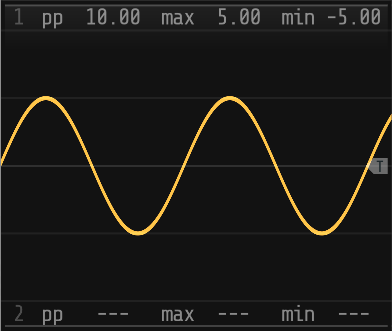
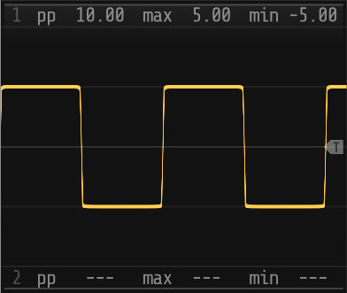
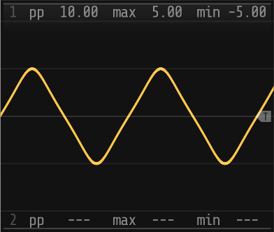
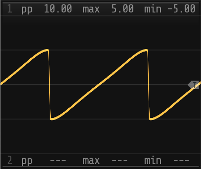
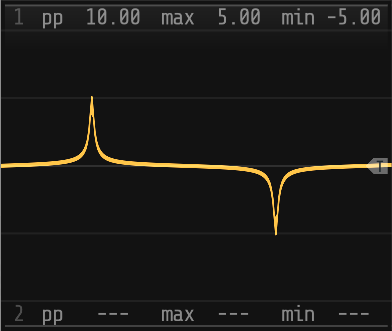
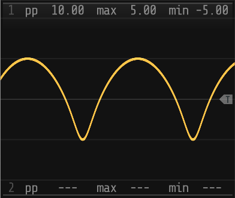
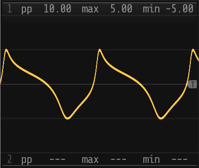

# **sn-lfo**

_sn-lfo_ is a more or less standard LFO module except that it produces a _sn_ output rather than a _sine_,
allowing the waveshape to be morphed between a sine, square, triangular and sawtooth wave and pretty much
everything in between. Although it can be used on its own, the module is really intended to be used as
the base for stacked _sn-lfox_ expanders. 

## Parameters

## Inputs and outputs

| Input       | Range  | Name         | Description                                                    |
|-------------|--------|--------------|----------------------------------------------------------------|
| _fm_        | ±5V    | _modulation_ | Modulates the frequency parameter                              |
| _sync_      | 0-10V  | _sync_       | Trigger input to reset the waveform to 0°                      |

| Output      | Range  | Name         | Description                                                    |
|-------------|--------|--------------|----------------------------------------------------------------|
| _LFO_       | ±5V    | _LFO_        | Polyphonal LFO signal output                                   |
| _AUX_       | ±5V    | _AUX_        | 2 channel 25Hz signal 'monitor' output for use with the scope  |
| _TRIG_      | 0-10V  | _trigger_    | Trigger output for the AUX output                              |

### Context Menu

1. _range_ 
   Sets the _range_ and _mode_ for the frequency parameter:
   - 0.1-10Hz (logarithmic)
   - 0.2-2Hz (logarithmic)
   - 0.5-20Hz (linear)

2. _k-rate_
   Sets the rate at which the parameter values are used to recalculate the waveform:
   - audio rate
   - ¹⁄₆₄ audio rate
   - ¹⁄₁₂₈ audio rate
   - ¹⁄₂₅₆ audio rate

3. _aux-mode_
   Sets the AUX output mode for display on the _scope_ module:
   - _OSC_ outputs a 25Hz 'monitor' waveform
   - _SUM_ outputs the summed 25Hz 'monitor' waveform
   - _POLY_ outputs the monitor wave form on channel 1 and the summed monitor waveform on channel 2 |

4. _aux-gain_
   Sets the AUX output gain for display on the _scope_ module:
   - 1 (±5V, 10V peak-to-peak)
   - ½ (±2.5V, 5V peak-to-peak)
   - ⅓ (±1.66V, 3.33V peak-to-peak)
   - ¼ (±1.25V, 2.5V peak-to-peak)
   - ⅕ (±1V, 2V peak-to-peak)

## Factory Presets

The module includes a set of factory presets:

| Preset         |  _ε_   | _s_ | _θ_ | _a_ | _δx_  | _δy_ | _Φ_ |
|----------------|--------|-----|-----|-----|-------|------|-----|
| sine           |  0.0   | 2.5 | 0°  | 1.0 |  0.0  | 0.0  | 0°  |
| square         | -1.0   | 5.0 | 0°  | 1.0 |  0.0  | 0.0  | 0°  |
| trianglular    |  0.175 | 5.0 | 0°  | 1.0 |  0.0  | 0.0  | 0°  |
| sawtooth-left  | -0.175 | 5.0 | 90° | 1.0 | -0.99 | 0.0  | 0°  |
| sawtooth-right | -0.175 | 5.0 | 90° | 1.0 | +0.99 | 0.0  | 0°  |

## Patches

### [*sn-vcv-lfo*](/documentation/patches/sn-vcv-vco.vcv)

Basic patch to demonstrate the operation of the _sn-lfo_ module. 

Replaces the LFOs in the basic _sn-vco_ patch with three independent _sn-lfo_ modules each with its own
waveform. The effect is to make the _sn-vco_ output morph in some weird and unexpected ways - most of
which don't sound good but at least a bit more perk-up-your-ears interesting.

_Requires_:
1. _Fundamental_ modules
