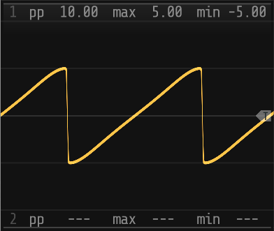

# **sn-vco**

_sn-vco_ is a more or less standard VCO module except that it produces a _sn_ output rather than a _sine_,
allowing the waveshape to be morphed between a sine, square, triangular and sawtooth wave and pretty much
everything in between. Although it can be used on its own, the module is really intended to be used as
the base for stacked _sn-vcox_ expanders. 

## Controls

| Control    | Range | Name           | Description                                                    |
|------------|-------|----------------|----------------------------------------------------------------|
| _ε_        | ±1    | _eccentricity_ | Sets the _eccentricity_ of the _sn_ generator function         |
| _s_        | 0-5   | _sensitivity_  | Fine adjust for the _eccentricity_ set by the _ε_ control      |
| _θ_        | ±90°  | _rotation_     | Sets the rotation angle of he _sn_ generator function          |
| _a_        | 0-1   | _amplitude_    | Sets the amplitude of the harmonic component                   |
| _δx_       | ±1    | _shift-x_      | Sets the horizontal shift of the _sn_ generator function       |
| _δy_       | ±1    | _shift-y_      | Sets the vertical shift of the _sn_ generator function         |
|            |       |                |                                                                |
| _ATT_      | 0-1   | _gain_         | Attenuates the summed output to bring it back into range       |

## Inputs and outputs

| Input      | Range | Name           | Description                                                    |
|------------|-------|----------------|----------------------------------------------------------------|
| _pitch_    | ±5V   | _frequency_    | Polyphonal 1V/octave pitch input, normalized for C4 at 0V      |
| _velocity_ | 0-10V | _velocity_     | Polyphonal MIDI note velocity input. Defaults to 10V (127)     |
|            |       |                |                                                                |
| _ε_        | ±5V   | _eccentricity_ | Modulates the _eccentricity_ parameter                         |
| _s_        | ±5V   | _sensitivity_  | Modulates the _sensitivity_ parameter                          |
| _θ_        | ±5V   | _rotation_     | Modulates the _rotation_ parameter                             |
| _a_        | ±5V   | _amplitude_    | Modulates the _amplitude_ parameter                            |
| _δx_       | ±5V   | _shift-x_      | Modulates the _shift-x_ parameter                              |
| _δy_       | ±5V   | _shift-y_      | Modulates the _shift-y_ parameter                              |

| Output     | Range | Name           | Description                                                    |
|------------|-------|----------------|----------------------------------------------------------------|
| _VCO_      | ±5V   | _VCO_          | Polyphonal VCO audio output                                    |
| _AUX_      | ±5V   | _AUX_          | 2 channel 25Hz signal 'monitor' output for use with the scope  |
| _TRIG_     | 0-10V | _trigger_      | Trigger output for the AUX output                              |

### Context Menu

1. _k-rate_
   Sets the rate at which the parameter values are used to recalculate the waveform:
   - audio rate
   - ¹⁄₆₄ audio rate
   - ¹⁄₁₂₈ audio rate
   - ¹⁄₂₅₆ audio rate

2. _aux-mode_
   Sets the AUX output mode for display on the _scope_ module:
   - _OSC_ outputs a 25Hz 'monitor' waveform
   - _SUM_ outputs the summed 25Hz 'monitor' waveform
   - _POLY_ outputs the monitor wave form on channel 1 and the summed monitor waveform on channel 2 |

3. _aux-gain_
   Sets the AUX output gain for display on the _scope_ module:
   - 1 (±5V, 10V peak-to-peak)
   - ½ (±2.5V, 5V peak-to-peak)
   - ⅓ (±1.66V, 3.33V peak-to-peak)
   - ¼ (±1.25V, 2.5V peak-to-peak)
   - ⅕ (±1V, 2V peak-to-peak)

## Factory Presets

The module includes a set of factory presets:
- sine
- square
- triangular
- sawtooth (left)
- sawtooth (right)

| Preset         |  _ε_   | _s_ | _θ_ | _a_ | _δx_  | _δy_ |
|----------------|--------|-----|-----|-----|-------|------|
| sine           |  0.0   | 2.5 | 0°  | 1.0 |  0.0  | 0.0  |
| square         | -1.0   | 5.0 | 0°  | 1.0 |  0.0  | 0.0  |
| trianglular    |  0.175 | 5.0 | 0°  | 1.0 |  0.0  | 0.0  |
| sawtooth-left  | -0.175 | 5.0 | 90° | 1.0 | -0.99 | 0.0  |
| sawtooth-right | -0.175 | 5.0 | 90° | 1.0 | +0.99 | 0.0  |

## Patches

### [*sn-vcv-vco*](/documentation/patches/sn-vcv-vco.vcv)

Basic patch to demonstrate the operation of the _sn-vco_ module. 

The patch basically connects three standard LFOs to _ε_, _δx_ and _δy_ inputs of a single _sn-vco_ module
to output a continuously varying waveform. Not very inspired and sounds pretty bland but should (hopefully)
give some idea of the operation of the module.

_Requires_:
1. _Fundamental_ modules
