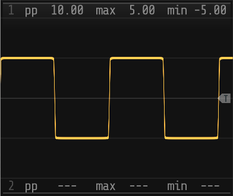
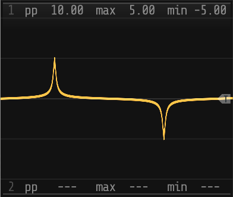
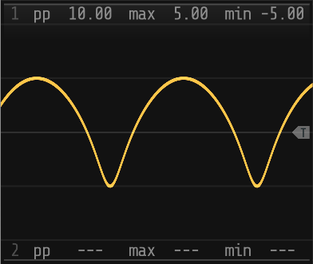

# **sn-vco**

The _sn_vco_ module implements a VCO with a waveshape generated by an _sn_ function which allows the waveshape to
be smoothly morphed between a sine, square, triangular and sawtooth:

## Parameters

| Input      | Range | Name           | Description                                                    |
|------------|-------|----------------|----------------------------------------------------------------|
| _pitch_    | ±5V   | _frequency_    | Polyphonal 1V/octave pitch input, normalized for C4 at 0V      |
| _velocity_ | 0-10V | _velocity_     | Polyphonal MIDI note velocity input. Defaults to 10V (127)     |
|            |       |                |                                                                |
| _ε_        | ±5V   | _eccentricity_ | Overrides the _eccentricity_ parameter control                 |
| _s_        | 0-10V | _sensitivity_  | Overrides the _sensitivity_ parameter control                  |
| _θ_        | ±5V   | _rotation_     | Overrides the _rotation_ parameter control                     |
| _a_        | 0-10V | _amplitude_    | Overrides the _amplitude_ parameter control                    |
| _δx_       | ±5V   | _shift-x_      | Overrides the _shift-x_ parameter control                      |
| _δy_       | ±5V   | _shift-y_      | Overrides the _shift-y_ parameter control                      |

| Output      | Range | Name          | Description                                                    |
|------------|-------|----------------|----------------------------------------------------------------|
| _VCO_      | ±5V   | _VCO_          | Polyphonal VCO audio output                                    |
| _AUX_      | ±5V   | _AUX_          | 2 channel 25Hz signal 'monitor' output for use with the scope  |
| _TRIG_     | 0-10V | _trigger_      | Trigger output for the AUX output                              |